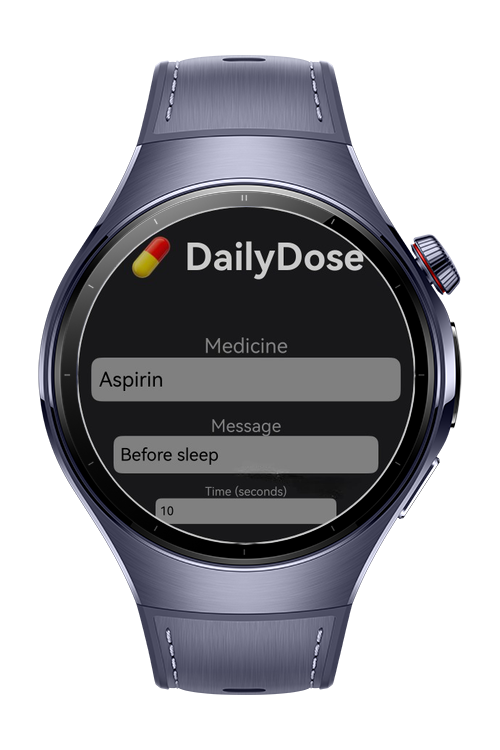
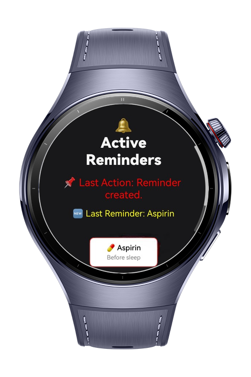
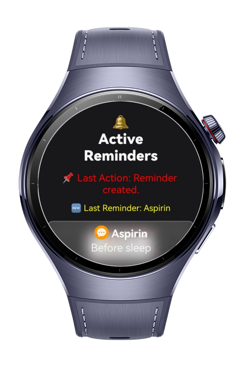

> **Note:** To access all shared projects, get information about environment setup, and view other guides, please visit [Explore-In-HMOS-Wearable Index](https://github.com/Explore-In-HMOS-Wearable/hmos-index).

# Daily Dose

**Daily-Dose** is a lightweight medication reminder app designed for **HarmonyOS NEXT wearable devices** using **ArkTS**.  
It helps users schedule recurring daily medication times and receive notifications via alarm, sound, and vibration.

Users can input the name of the medicine, a short description.  
The app will trigger a local notification and vibration at the specified time.

---


# Preview

<div>
  
  
  
</div>

---

# Use Cases
1. **Request Notification Permission** :  App asks for notification permission when opened; user grants access.
2. **Create Medicine Reminder** : User enters medicine name, message, and time on the main screen and saves the reminder.
3. **Receive Reminder Notification** :  System shows a notification with a custom title and message at the scheduled time.
4. **Trigger Vibration Alert** :  Device vibrates when a reminder is triggered.
5. **View Reminder List** : User views all upcoming reminders in a list screen.

---

# Technology

## Stack
**Languages**: ArkTS

**Frameworks**: HarmonyOS SDK 5.1.0(18)

**Tools**: DevEco Studio Vers 5.1.0.842

**Libraries**: @kit.ArkUI, @kit.BackgroundTasksKit, @kit.NotificationKit, @kit.SensorServiceKit

## Required Permissions

- `ohos.permission.PUBLISH_AGENT_REMINDER`
- `ohos.permission.KEEP_BACKGROUND_RUNNING`
- `ohos.permission.VIBRATE`

---


# Directory Structure
````
entry/src/main/ets/
├── pages/
│   ├── Index.ets                   # Home page / landing screen  
│   └── ReminderListPage.ets        # View active reminders
│
├── utils/
│   └── RequestPermission.ets       # Request Notification Permission   
│
├── view/
│   └── MedicineInput.ets           # Input Design Component   
│
├── viewmodel/
│   └── MedicineViewModel.ets       # Creating reminder and set text  
│
├── entryability/
│   └── EntryAbility.ets            # Ability definition
│
├── entrybackupability/
│   └── EntryBackupAbility.ets      # Backup metadata
│
├── module.json5                    # App metadata, permissions
└── build-profile.json5             # Signing config and SDK info
````

---

# Constraints and Restrictions

## Supported Device
- Huawei Watch 5

---

# License 

DailyDose is distributed under the terms of the MIT License. 

See the [LICENSE](/LICENSE) for more information.